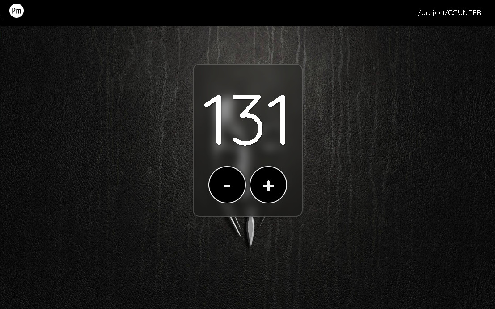

<!-- Improved compatibility of torna all'inizio link: See: https://github.com/othneildrew/Best-README-Template/pull/73 -->

<!--
*** Thanks for checking out the Best-README-Template. If you have a suggestion
*** that would make this better, please fork the repo and create a pull request
*** or simply open an issue with the tag "enhancement".
*** Don't forget to give the project a star!
*** Thanks again! Now go create something AMAZING! :D
-->

<!-- PROJECT SHIELDS -->
<!--
*** I'm using markdown "reference style" links for readability.
*** Reference links are enclosed in brackets [ ] instead of parentheses ( ).
*** See the bottom of this document for the declaration of the reference variables
*** for contributors-url, forks-url, etc. This is an optional, concise syntax you may use.
*** https://www.markdownguide.org/basic-syntax/#reference-style-links
-->
[![Contributors][contributors-shield]][contributors-url]
[![Forks][forks-shield]][forks-url]
[![Stargazers][stars-shield]][stars-url]
[![Issues][issues-shield]][issues-url]
[![Unlicense License][license-shield]][license-url]
[![LinkedIn][linkedin-shield]][linkedin-url]

<!-- PROJECT LOGO -->
 

  

  <h3 align="center">Esempio di contatore in JS</h3>

  

    Come creare un contatore in JS da codice !
     
    ( costruzione dinamica HTML, uso delegato, arrow function, CSS with SASS )
     
    <b>start2Impact ./projects/COUNTER</b>
     
    <a href="https://github.com/othneildrew/Best-README-Template"><strong>Naviga nella guida »</strong></a>
     
     
    <a href="https://paolomarcolli.github.io/099-S2I-js-exam/">Demo</a>
    &middot;
    <a href="https://paolomarcolli.github.io/099-S2I-js-exam/issues/new?labels=bug&template=bug-report---.md">Correzione bug</a>
    &middot;
    <a href="https://paolomarcolli.github.io/099-S2I-js-exam/issues/new?labels=enhancement&template=feature-request---.md">Richiedi implementazioni</a>
  

<!-- Contenuti -->

  
Lista dei contenuti

  <ol>
    <li>
      <a href="#descrizione-del-progetto">Descrizione del progetto</a>
      <ul>
        <li><a href="#tecnologie-di-sviluppo">Tecnologie di sviluppo</a></li>
      </ul>
    </li>
    <li>
      <a href="#avvio-rapido">Avvio rapido</a>
      <ul>
        <li><a href="#prerequisiti">Prerequisiti</a></li>
        <li><a href="#technical-requirements">Richieste tecniche</a></li>
        <li><a href="#Installazione">Installazione</a></li>
        <li><a href="#rilascio-github">Rilascio su GitHub</a></li>
        <li><a href="#presentazione">Prima di inviare</a></li>
        <li><a href="#prima-di-inviare">Prima di inviare</a></li>
      </ul>
    </li>
    <li><a href="#parametri-valutazione-esame">Parametri valutazione esame</a></li>
    <li><a href="#utilizzo">Utilizzo</a></li>
    <li><a href="#passaggi-per-sviluppo">Passaggi per sviluppo</a></li>
    <li><a href="#contributi">Contributi</a></li>
    <li><a href="#licenza">Licenza</a></li>
    <li><a href="#contatti">Contatti</a></li>
    <li><a href="#risorse-utili">Risorse utili</a></li>
    <li><a href="#bonus-mentoring">Bonus Mentoring</a></li>
  </ol>

## Descrizione del progetto
<!-- Descrizione del progetto OK -->

<b>Sviluppa un'applicazione JavaScript che permetta all'utente di aumentare e decrementare il valore del counter.</b>

L'utente, appena entrato nella pagina, visualizzerà 0 come valore del counter e avrà a disposizione due pulsanti +/- per cambiare il valore del counter.

(<a href="#readme-top">torna all'inizio</a>)

### Tecnologie di sviluppo
<!-- Tecnologie di sviluppo OK -->

Questa sezione dovrebbe elencare tutti i principali framework/librerie utilizzati per avviare il progetto. Lascia eventuali componenti aggiuntivi/plugin per la sezione dei ringraziamenti. Ecco alcuni esempi.

* [![JavaScript][JavaScript.js]][JavaScript-url]
* [![React][React.js]][React-url]
* [![Vue][Vue.js]][Vue-url]
* [![Angular][Angular.io]][Angular-url]
* [![Svelte][Svelte.dev]][Svelte-url]
* [![Laravel][Laravel.com]][Laravel-url]
* [![Bootstrap][Bootstrap.com]][Bootstrap-url]
* [![JQuery][JQuery.com]][JQuery-url]
* [![JavaScript][JavaScript.js]][JavaScript-url]

(<a href="#readme-top">torna all'inizio</a>)

## Avvio rapido
<!-- GETTING STARTED OK -->

Il progetto funziiona esclusivamente da web, non necessita librerie di terze parti, basta collagarsi all'url <a href="https://paolomarcolli.github.io/099-S2I-js-exam">./project/COUNTER</a> ed è fatta. Il sito è totalmente responsivo realizzato usando la sola MSFlex, senza alcun framework come richiesto
dal relatore.  

(<a href="#readme-top">torna all'inizio</a>)

### Prerequisiti
<!-- PREREQUISITES OK -->
Non necessario.

(<a href="#readme-top">torna all'inizio</a>)

### Technical requirements

L'applicazione deve essere sviluppata con JavaScript. 
Non è permesso l'utilizzo di Jquery, non è permesso l'utilizzo di nessun framework (React, Angular, Vue o altri).
È permesso l'utilizzo, se necessario, di librerie esterne JavaScript.
I pulsanti +/- e la visualizzazione del valore del counter devono essere costruiti con la manipolazione del DOM con JavaScript. 

Una volta costruiti gli elementi con JavaScript, si dovrà implementare la funzione che aggiungerà e diminuirà il valore del counter.

Sono ammesse tutte le funzionalità aggiuntive che si ritengono necessarie.

(<a href="#readme-top">torna all'inizio</a>)

### Installazione
<!-- INSTALLATION OK -->

Non necessaria. 

(<a href="#readme-top">torna all'inizio</a>)

<!-- USAGE EXAMPLES -->

### Rilascio GitHub
<!-- GITHUB-RELEASE OK -->

Il progetto deve essere committato nel tuo repository GitHub.

Il repository GitHub deve contenere tutto il codice sorgente dell'applicazione e il file README contenente la descrizione del progetto, screenshot dell'applicazione (se necessario) e il link, ben visibile, di dove provare l'applicazione.

Inserisci tutte le informazioni che ritieni opportune.

Di seguito trovi vari risorse utili per creare un buon README:

README Template
Awesome README
README
cercare su Google “git README template”
Prima di inviare il progetto controlla che l'applicazione funzioni correttamente.

Se nel repository GitHub non è presente tutto il codice sorgente dell'applicazione, il progetto non verrà corretto.

Ti consigliamo infine di deployare il progetto su qualsiasi webhost gratuito (per esempio Netlify e Firebase). Questo sarà fondamentale per condividere il progetto e renderlo fruibile da chiunque.

(<a href="#readme-top">torna all'inizio</a>)

### Presentazione

Crea una presentazione del tuo progetto in formato PDF e inserisci il link al repository GitHub.

Per la presentazione puoi utilizzare qualsiasi tool; noi consigliamo Canva e beautiful.ai.

Nella presentazione includi tutte le informazioni che possono essere utili per la correzione.

Se la presentazione non presenta il link al repository GitHub, il progetto non verrà corretto.

(<a href="#readme-top">torna all'inizio</a>)

### Prima di inviare
<!-- BEFORE-SENDING OK -->

Sei a un passo dal tuo obiettivo!

Carica il tuo file qui sotto.

Il nome del file deve essere strutturato in questo modo:

“Progetto JavaScript di Nome Cognome”.

Non vediamo l’ora di verificare le tue competenze e ricorda che il difficile è solo iniziare, poi la strada è tutta in discesa.

Metticela tutta, noi siamo qui per darti tutti i feedback necessari alla tua crescita nell’attesa di vederti spiccare il volo!

Il tuo progetto verrà corretto da un professionista del settore con 5 anni di esperienza in media, che ti spiegherà punto per punto cosa hai fatto bene e cosa migliorare in un feedback personalizzato.

(<a href="#readme-top">torna all'inizio</a>)

## Parametri valutazione esame

La valutazione del progetto segue i seguenti criteri.

Verrà valutato il funzionamento dell'applicazione con il corretto funzionamento dei pulsanti +/-.

Verrà valutata la corretta implementazione dei pulsanti +/- e della visualizzazione del valore counter attraverso l'utilizzo di JavaScript.

Verrà valutata la bontà del codice scritto. Ci si aspetta una giusta suddivisione e implementazione delle logiche del progetto (cambio valore, visualizzazione valore) in diverse funzioni e, se necessario, in diversi file. 

Verrà valutata la bontà della struttura del progetto: 

Il contenuto HTML nell'apposito file index.html
Il contenuto del codice JavaScript all'interno di file .js contenuto nella cartella js
Il contenuto dello stile del progetto all'interno del file .css contenuti nella cartella css
Il contenuto delle immagini (se necessarie) all'interno dell'apposita cartella img
Verrà valutata la corretta creazione del repository GitHub (file README).

Per raggiungere il massimo del punteggio, il progetto deve soddisfare appieno tutti i requisiti descritti.

(<a href="#readme-top">torna all'inizio</a>)

## Utilizzo
<!-- UTILIZZO OK -->
Usa questo spazio per mostrare esempi utili di come un progetto può essere utilizzato. Ulteriori screenshot, esempi di codice e demo funzionano bene in questo spazio. Puoi anche collegarti ad altre risorse.

_Per ulteriori esempi, fare riferimento a [Documentation](https://example.com)_

(<a href="#readme-top">torna all'inizio</a>)

## Passaggi per sviluppo
<!-- ROADMAP OK -->
- [x] Creazione repository GitHub.
- [x] Aggiunta del file README.md, immagini, risorse, ecc....
- [x] Pubblicazione su GitHub.
- [x] Sviluppo applicazione.
  - [ ] Controllo se l'applicazione rispecchia le richieste delle progetto dell'esame.
  - [x] Collaudo.
  - [ ] Ottimizzazioni / semplificazione codice ( se necessarie ).
  - [ ] Aggiunta commenti ( se necessarie ).
- [x] Completa il README.md file.
  - [x] Contenuto Descrizione del progetto.
  - [ ] Contenuto Tecnologie di sviluppo.
  - [x] Contenuto Avvio rapido.
    - [x] Contenuto Prerequisiti.
    - [ ] Contenuto Richieste tecniche.
    - [x] Contenuto Installazione.
    - [ ] Rilascio su GitHub.
    - [ ] Presentazione.
    - [ ] Prima di inviare.
  - [x] Parametri valutazione esame.
  - [x] Contenuto Utilizzo.
  - [x] Contenuto Passaggi per sviluppo.
  - [x] Contributi.
  - [x] Licenza.
  - [x] Contatti.
  - [x] Risorse utili.
  - [x] Bonus Mentoring.
- [ ] Traduci tutto in italiano.

See the [open issues](https://github.com/othneildrew/Best-README-Template/issues) for a full list of proposed features (and known issues).

(<a href="#readme-top">torna all'inizio</a>)

## Contributi
<!-- CONTRIBUTI OK -->
I contributi sono ciò che rende la comunità open source un posto così straordinario per imparare, ispirare e creare. Ogni contributo che fai è **fortemente apprezzato**.

Se hai un suggerimento che potrebbe migliorare la situazione, fai un fork del repo e crea una richiesta di pull. Puoi anche semplicemente aprire un problema con il tag "enhancement".
Non dimenticare di dare una stella al progetto! Grazie ancora!

1. Fork del progetto
2. Crea il tuo Feature Branch (`git checkout -b feature/AmazingFeature`)
3. Esegui il commit delle tue modifiche (`git commit -m 'Add some AmazingFeature'`)
4. Esegui il push sul Branch (`git push origin feature/AmazingFeature`)
5. Apri una Pull Request

(<a href="#readme-top">torna all'inizio</a>)

### Top contributors:

(<a href="#readme-top">torna all'inizio</a>)

## Licenza
<!-- LICENSE OK -->
Distribuito sotto la licenza Unlicense. Per maggiori informazioni, vedere `LICENSE.txt`.

(<a href="#readme-top">torna all'inizio</a>)

## Contatti
<!-- CONTACT OK -->
Paolo Marcolli - [https://github.com/PaoloMarcolli](https://github.com/PaoloMarcolli) - paolo.marcolli.fl@gmail.com

Project Link: [https://github.com/PaoloMarcolli/099-S2I-js-exam](https://github.com/PaoloMarcolli/099-S2I-js-exam)

(<a href="#readme-top">torna all'inizio</a>)

## Risorse utili
<!-- ACKNOWLEDGMENTS OK -->
Usa questo spazio per elencare le risorse che ritieni utili e a cui vorresti dare credito. Ho incluso alcune delle mie preferite per dare il via alle cose!

* [Javascript Tutorial Italiano 01 - Introduzione a JS](https://www.youtube.com/watch?v=84TYC44ezIU&t=2s)
* [Javascript Tutorial Italiano 09 - Introduzione alle Funzioni](https://www.youtube.com/watch?v=YR6AG_oA-fs&t=1s)
* [Javascript Tutorial Italiano 10 - Funzioni personalizzate](https://www.youtube.com/watch?v=WyC678zya3E)
* [Javascript Tutorial Italiano 11 - Return valori dalle Funzioni](https://www.youtube.com/watch?v=zq6chg-0Nx0&t=2s)
* [Javascript Tutorial Italiano 12 - Introduzione agli EVENTI](https://www.youtube.com/watch?v=qQHGRStxxJg&t=1s)
* [How To Make Your Own JavaScript Events](https://www.youtube.com/watch?v=DzZXRvk3EGg&t=3s)
* [Learn JavaScript Event Listeners In 18 Minutes](https://www.youtube.com/watch?v=XF1_MlZ5l6M&t=2s)
* [User input in JavaScript ⌨️ 【4 minutes】](https://www.youtube.com/watch?v=fARJwGqdbKQ&t=1s)
* [JavaScript Tutorial - "DOMContentLoaded" event | When is it safe to interact with the DOM?](https://www.youtube.com/watch?v=m1DH8ljCqzo&t=2s)
* [JavaScript Tutorial For Beginners #41 - Window onLoad Event](https://www.youtube.com/watch?v=RVA4HoEE_q8&t=1s)
* [Build A Calculator With JavaScript Tutorial](https://www.youtube.com/watch?v=j59qQ7YWLxw&t=4s)
* [Build A Clock With JavaScript](https://www.youtube.com/watch?v=Ki0XXrlKlHY)
* [Build 3 Beginner Javascript Projects in 30 mins Tutorial - HTML, CSS & JS](https://www.youtube.com/watch?v=mCQ1-iDSnto&t=1s)

(<a href="#readme-top">torna all'inizio</a>)

## Bonus mentoring
<!-- BONUS MENTORING OK -->
<b>Pubblica su LinkedIn</b>

Trasforma il tuo percorso di studi in opportunità grazie a LinkedIn!

Hai mai pensato che ogni tua scoperta e ogni sfida superata durante il Master potrebbe ispirare decine di altre persone e attrarre opportunità inaspettate?

Su LinkedIn, il tuo viaggio di apprendimento diventa il tuo biglietto da visita più potente con le aziende.

Pubblica i tuoi progetti, condividi i tuoi ostacoli e le tue vittorie, e lascia che il tuo percorso parli per te.

Non è solo un modo per celebrare i tuoi progressi: è la tua chance di attrarre opportunità che ti cambieranno la vita e di ispirare altre persone a trovare la loro strada.

Ricorda, dietro ogni grande professionista c'è sempre una storia di crescita.

Non sai bene come creare un post su LinkedIn?

<a href="https://www.start2impact.it/wp-content/uploads/2024/06/Guida-Come-creare-un-post-su-LinkedIn.pdf" target="_blank" title="">Qui trovi una breve guida che riassume come farlo in 5 punti.</a>

(<a href="#readme-top">torna all'inizio</a>)

<b>Condividi su Instagram o TikTok</b>

Sono Instagram o TikTok i social in cui senti di voler trasmettere la tua voce?

In questo caso, puoi pubblicare una o più stories o contenuti che raccontino il progetto a cui stai lavorando.

Quello che per te è un giorno di studio, per altri può diventare la scintilla che accende passione e voglia di mettersi in gioco!

Puoi scegliere di condividere la tipologia di contenuto che preferisci, e taggarci.

Se inserisci nella parte finale del tuo progetto una slide intitolata “Bonus Mentoring” contenente uno screenshot dei contenuti creati, su LinkedIn, Instagram o TikTok, guadagnerai 100 punti bonus nella soft skill Mentoring.

Questo è uno step facoltativo: i punti non influiranno sul punteggio totale e saranno attribuiti soltanto alla soft skill Mentoring, ma potrà essere il tassello per attrarre nuove opportunità e ispirare altre persone, proprio come un vero Mentor ✨

(<a href="#readme-top">torna all'inizio</a>)

<!-- MARKDOWN LINKS & IMAGES -->
<!-- https://www.markdownguide.org/basic-syntax/#reference-style-links -->
[contributors-shield]: https://img.shields.io/github/contributors/othneildrew/Best-README-Template.svg?style=for-the-badge
[contributors-url]: https://github.com/othneildrew/Best-README-Template/graphs/contributors
[forks-shield]: https://img.shields.io/github/forks/othneildrew/Best-README-Template.svg?style=for-the-badge
[forks-url]: https://github.com/othneildrew/Best-README-Template/network/members
[stars-shield]: https://img.shields.io/github/stars/othneildrew/Best-README-Template.svg?style=for-the-badge
[stars-url]: https://github.com/othneildrew/Best-README-Template/stargazers
[issues-shield]: https://img.shields.io/github/issues/othneildrew/Best-README-Template.svg?style=for-the-badge
[issues-url]: https://github.com/othneildrew/Best-README-Template/issues
[license-shield]: https://img.shields.io/github/license/othneildrew/Best-README-Template.svg?style=for-the-badge
[license-url]: https://github.com/othneildrew/Best-README-Template/blob/master/LICENSE.txt
[linkedin-shield]: https://img.shields.io/badge/-LinkedIn-black.svg?style=for-the-badge&logo=linkedin&colorB=555
[linkedin-url]: https://linkedin.com/in/othneildrew
[product-screenshot]: images/screenshot.png
[Next.js]: https://img.shields.io/badge/next.js-000000?style=for-the-badge&logo=nextdotjs&logoColor=white
[Next-url]: https://nextjs.org/
[React.js]: https://img.shields.io/badge/React-20232A?style=for-the-badge&logo=react&logoColor=61DAFB
[React-url]: https://reactjs.org/
[Vue.js]: https://img.shields.io/badge/Vue.js-35495E?style=for-the-badge&logo=vuedotjs&logoColor=4FC08D
[Vue-url]: https://vuejs.org/
[Angular.io]: https://img.shields.io/badge/Angular-DD0031?style=for-the-badge&logo=angular&logoColor=white
[Angular-url]: https://angular.io/
[Svelte.dev]: https://img.shields.io/badge/Svelte-4A4A55?style=for-the-badge&logo=svelte&logoColor=FF3E00
[Svelte-url]: https://svelte.dev/
[Laravel.com]: https://img.shields.io/badge/Laravel-FF2D20?style=for-the-badge&logo=laravel&logoColor=white
[Laravel-url]: https://laravel.com
[Bootstrap.com]: https://img.shields.io/badge/Bootstrap-563D7C?style=for-the-badge&logo=bootstrap&logoColor=white
[Bootstrap-url]: https://getbootstrap.com
[JQuery.com]: https://img.shields.io/badge/jQuery-0769AD?style=for-the-badge&logo=jquery&logoColor=white
[JQuery-url]: https://jquery.com 
